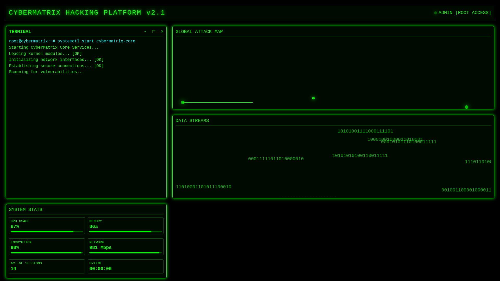

# CyberMatrix Hacking Simulator


![(Screenshot from 2025-03-13 20-11-18.png)]


A visually stunning, interactive hacking simulator with a retro-cyberpunk aesthetic. This project creates an immersive "Hollywood-style" hacking experience with animations, simulated terminal commands, attack maps, and system statistics.

## 🌐 Demo

[View Live Demo](https://ProgCrafterq.github.io/cybermatrix-hacking-simulator/) 



## ✨ Features

- **Authentic Terminal Experience**: Interactive command-line interface with realistic hacking commands and responses
- **Global Attack Map**: Visual representation of simulated cyber attacks happening across the world
- **Matrix-Style Login Screen**: Animated background with falling code reminiscent of The Matrix
- **Live System Stats**: Dynamic CPU, memory, encryption, and network usage displays
- **Binary Data Streams**: Visualized data flows representing active hacking operations
- **Responsive Design**: Works on desktop and mobile devices

## 🚀 Quick Start

1. Clone the repository:
   ```bash
   git clone https://github.com/ProgCrafterq/cybermatrix-hacking-simulator.git
   ```

2. Open `index.html` in your browser.

3. Login credentials:
   - Username: admin
   - Password: 52877

## 🛠️ Technologies Used

- **Frontend**: Pure HTML, CSS, and vanilla JavaScript
- **Graphics**: Canvas API for dynamic visual effects
- **Design**: Custom CSS animations and transitions

## 📋 Project Structure

- `index.html` - Main entry point and structure
- `style.css` - All styling and animations
- `script.js` - Core application logic and effects

## 🎮 How to Use

1. Enter the login credentials on the Matrix-style login screen
2. Explore the terminal by typing commands (or watch auto-generated commands)
3. Monitor the global attack map showing simulated cyber attacks
4. Check system statistics for current CPU, memory, and network usage
5. Observe the binary streams representing data flows

## 🤝 Contributing

Contributions, issues, and feature requests are welcome! Feel free to check the [issues page](https://github.com/your-username/cybermatrix-hacking-simulator/issues).


## 📌 Disclaimer

This project is intended for educational and entertainment purposes only. It simulates the appearance of hacking tools but does not contain actual hacking functionality. Do not use any concepts demonstrated in this project for unauthorized access to computer systems.

## 🙏 Acknowledgements

- Inspired by Hollywood hacker scenes and cyberpunk aesthetics
- Matrix digital rain effect adapted from various open-source implementations
